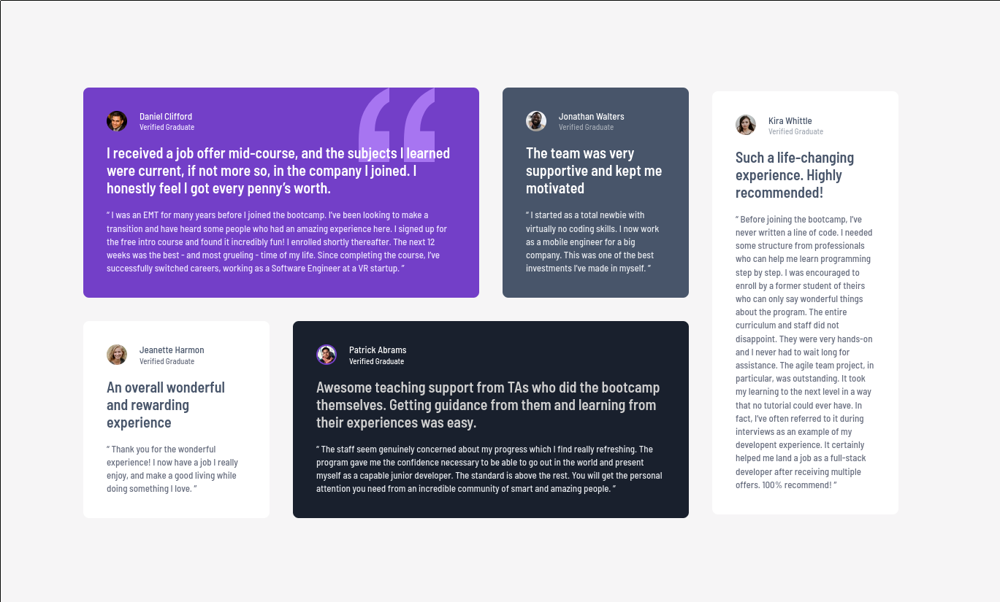

# Frontend Mentor - Testimonials grid section solution

This is a solution to the [Testimonials grid section challenge on Frontend Mentor](https://www.frontendmentor.io/challenges/testimonials-grid-section-Nnw6J7Un7). Frontend Mentor challenges help you improve your coding skills by building realistic projects. 

## Table of contents

- [Overview](#overview)
  - [The challenge](#the-challenge)
  - [Screenshot](#screenshot)
  - [Links](#links)
- [My process](#my-process)
  - [Built with](#built-with)
  - [What I learned](#what-i-learned)
  - [Continued development](#continued-development)
- [Author](#author)

## Overview

### The challenge

Users should be able to:

- View the optimal layout for the site depending on their device's screen size

### Screenshot



### Links

- Solution URL: [GitHub](https://github.com/ryanwells-rwc/testimonials-grid-section)
- Live Site URL: [Netlify](https://testimonials-grid-section-rwc.netlify.app/)

## My process

### Built with

- Semantic HTML5 markup
- SASS
- Flexbox
- CSS Grid
- Mobile-first workflow

### What I learned

I learned to use nested flexboxes to properly position avatar images and 
text. I also learned to use the `minmax()` function to size items in a grid.

```css
@media (min-width: 1440px) {
  main {
    grid-template-columns: repeat(6, minmax(255px, 1fr));
    grid-template-areas:
    ". article-daniel article-daniel article-jonathan article-kira ."
    ". article-jeanette article-patrick article-patrick article-kira .";
    padding: calc(229 / 16 * 1rem) calc(161 / 16 * 1rem) calc(218 / 16 * 1rem) calc(165 / 16 * 1rem);

    .background-element {
      background-position-x: 86%;
    }
  }
}
```

### Continued development

In the future I'd like to learn about locking the sizes of grid items as the 
screen size expands dynamically.

## Author

- Website - [Ryan Wells](https://ryanwells.io)
- Frontend Mentor - [@ryanwells-rwc](https://www.frontendmentor.io/profile/ryanwells-rwc)
